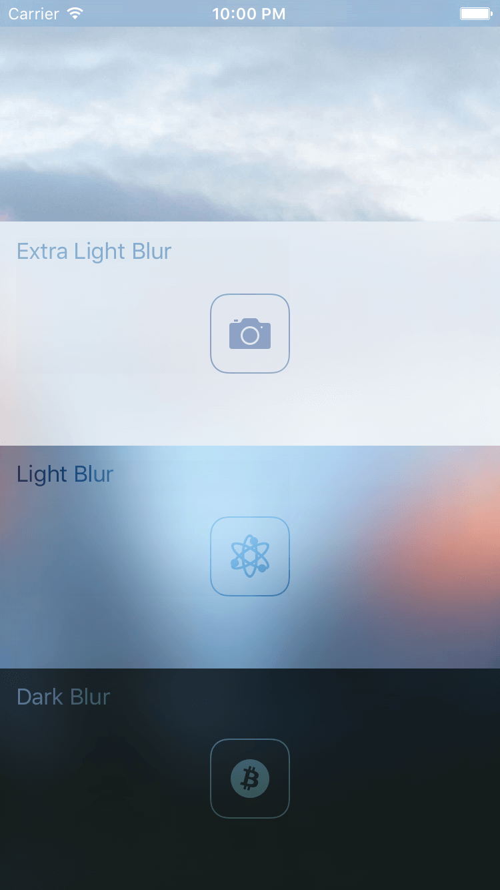

UIVisualEffects
===============

Learn how to use UIVisualEffectViews with UIBlurEffect and UIVibrancyEffect in iOS 8. The example is written in Swift.

UIVisualEffectView and UIVisualEffect
-------------------------------------

iOS 8 lets you blur your UI with UIVisualEffectView and a UIVisualEffect of your choice. You can choose amongst various blurring and vibrancy effects as shown in the screenshot above.  The API is particular about how you compose the views and which colors and image rendering modes you pick; otherwise it may not display the effect you expect. This example shows you how to use UIVisualEffectView with UIBlurEffect and UIVibrancyEffect.

### Blurring

There are three types of blurring: extra light, light, and dark. You specify one of those three types when creating a UIBlurEffect, which you then use to create a UIVisualEffectView. **UIVisualEffectView blurs the views underneath it. It does not blur subviews of its contentView.** Note that you should add subviews to the UIVisualEffectView's contentView rather than itself.

### Vibrancy

The vibrancy effect lets the content underneath a blurred view show through more vibrantly. It looks pretty but can make text and icons harder to read so use it judiciously. You specify a UIBlurEffect when creating a UIVibrancyEffect. The UIBlurEffect should be the one you used to create the blurred UIVisualEffectView. You then use the UIVibrancyEffect to create another UIVisualEffectView that you add to the blurred UIVisualEffectView's contentView.

To render vibrant text, create a UILabel and add it to the vibrancy UIVisualEffectView's contentView. The color of the UILabel does not affect its appearance.

For vibrant images, create a UIImage that is treated as a template mask with `UIImageRenderingMode.AlwaysTemplate`. One side effect is that the colors in your image are ignored. However, this lets you easily use your image in a vibrancy UIVisualEffectView. As with text, you add the UIImage to the vibrancy UIVisualEffectView's contentView.

In early iOS 8 betas you could [cancel the vibrancy effect](CancelingVibrancy.md) so that subviews would look blurred on top of a vibrant background. However, this undocumented effect has been removed.
